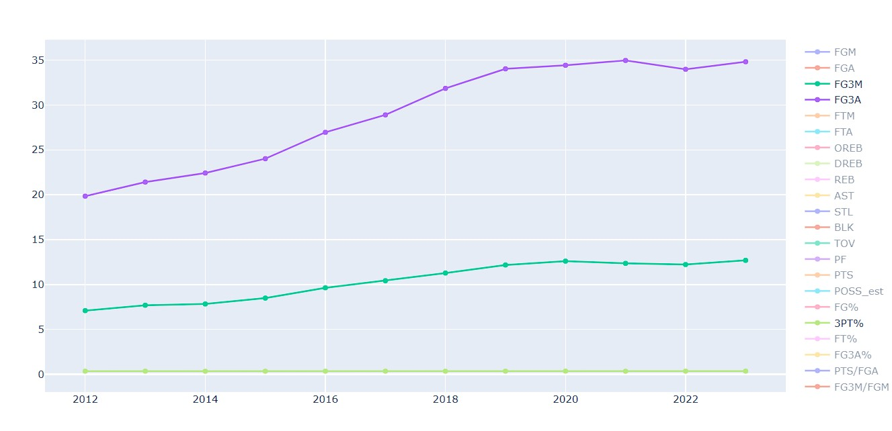
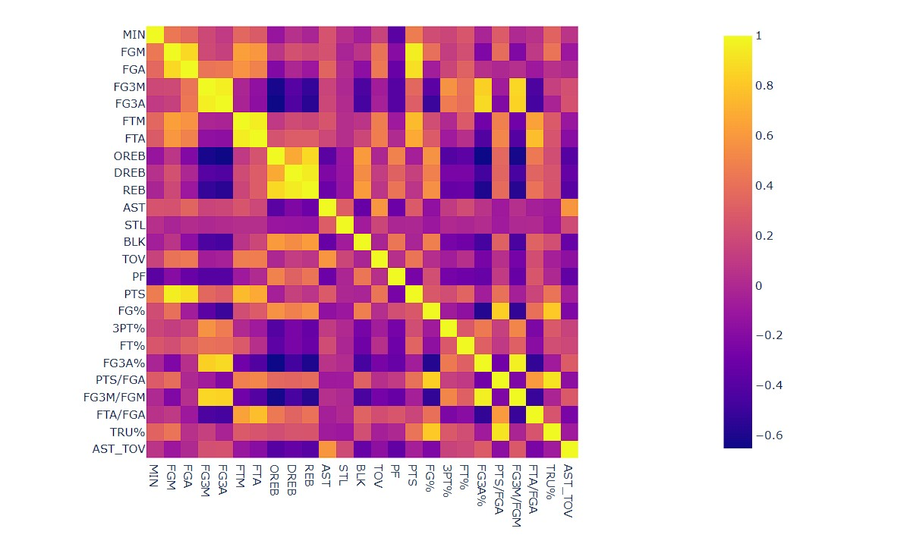
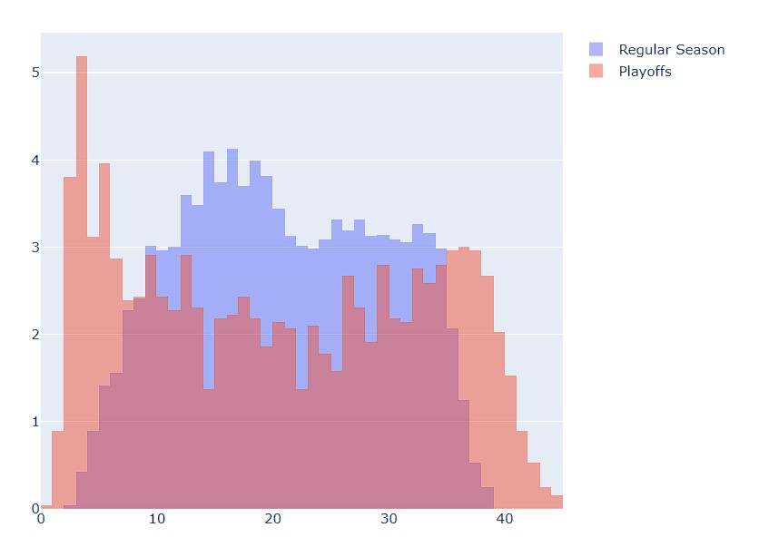

# 🏀VisualHoops

## Overview

\*VisualHoops** is a data-driven exploration of how the NBA has evolved over the past decade (2012–2024). From three-point revolutions to shifting playoff dynamics, this project dives deep into player performance trends and strategic transformations using data scraped directly from [NBA.com/stats](https://www.nba.com/stats/). Built for analysts and basketball enthusiasts, this project combines **Python**, **pandas**, and **plotly** within an interactive **Jupyter Notebook\*\* environment.

---

## 🚀 Key Features

### 📊 Part 1: Data Scraping

- Utilizes **Python requests** to scrape data from the NBA stats API.
- Processes regular season and playoff data for all players over 10 seasons.
- Implemented anti-blocking measures (lag/random delays) to ensure reliable batch scraping.
- Saved cleanly structured datasets to Excel (`NBA_PlayerData.xlsx`) for analysis and sharing.

### 📈 Part 2: Data Analysis & Visualization

- Cleaned and standardized the dataset (team names, missing values, stat types).
- Segmented **regular season vs playoff** performance.
- Differentiated between regular season (RS) and playoff (PO) data.
- Used `plotly`, `seaborn`, and `matplotlib` for interactive charts that highlight gameplay trends and statistical relationships.

---

## 💡 What I Built & Learned

- Built a fully modular, notebook-based analytics pipeline for data scraping, cleaning, and visualization.
- Strengthened practical skills in **sports analytics**, **data preprocessing**.
- Visualized complex trends from large time-series datasets using best practices in data analysis.
- Applied interactive visualization tools (e.g., `plotly` sliders, heatmaps) to create intuitive and explorable insights.
- Identified key gameplay trends, including increased reliance on **three-point shooting**, **playoff foul patterns**, and **reduced bench usage** in postseason games.

---

## 📸 Highlights

<sub>These are just a few snapshots. The full Jupyter Notebook includes dozens of interactive charts, gameplay shifts, and deep stat breakdowns.</sub>

### 📈 Evolution of the 3-Point Era

NBA’s growing reliance on perimeter shooting.  


### 🔥 Stat Synergy Heatmap

Correlation matrix reveals which stats move together.  


### 🕒 Minutes Played: RS vs Playoffs

Tighter playoff rotations shown through minutes distribution.  


## 🔍 Key Takeaways

- **Strategic Shift**: NBA teams are taking nearly 3× more three-point attempts than a decade ago.
- **Efficiency Rise**: Despite faster pace, shooting percentages have generally improved.
- **Playoff Behavior**: Fouls increase, benches shorten, and defensive effort intensifies post-season.
- **Role Adaptation**: Star players carry heavier minutes loads in playoffs compared to regular season.

> These are just a few highlights — the full notebook reveals even more nuanced trends, interactive visualizations, and player-specific insights when explored in depth.

## Technologies Used

- **Python** – core scripting and analysis
- **pandas** – data wrangling and transformation
- **plotly & matplotlib** – interactive and static visualizations
- **openpyxl** – Excel export for scraped data
- **Jupyter Notebook** – all-in-one exploratory analysis environment

---

## ⚙️ How to Run Locally

### 1. Clone the Repository

```bash
git clone https://github.com/haiderali077/hoop-metrics.git
cd VisualHoops
```

### 2. Install Required Packages

```bash
pip install -r requirements.txt
```

### 3. Run the Notebook

Launch Jupyter and open `nba_analysis.ipynb`:

```bash
jupyter notebook
```

---

## 🗂️ File Structure

```
├── scrape_data.py              # Raw data collection script
├── nba_analysis.ipynb          # Main notebook for analysis and visuals
├── NBA_PlayerData.xlsx         # Cleaned player stats (output)
├── /images                     # Visuals used in README
└── requirements.txt            # All dependencies
```

---

## 👤 About Me

Hi! I'm **Haider Ali**, a Computer Science student passionate about data science, and sports.

This project allowed me to strengthen my skills in:

- Real-world data extraction and cleaning
- Python scripting and automation
- Exploratory data analysis and interactive visualization

I'm always looking to grow and take on new challenges in data analytics and software development.

🔗 [GitHub – haiderali077](https://github.com/haiderali077)

---

## 📄 License

This project is licensed under the [MIT License](LICENSE).  
NBA data sourced from [NBA.com/stats](https://www.nba.com/stats/). This project is for educational purposes only and is not affiliated with the NBA.
